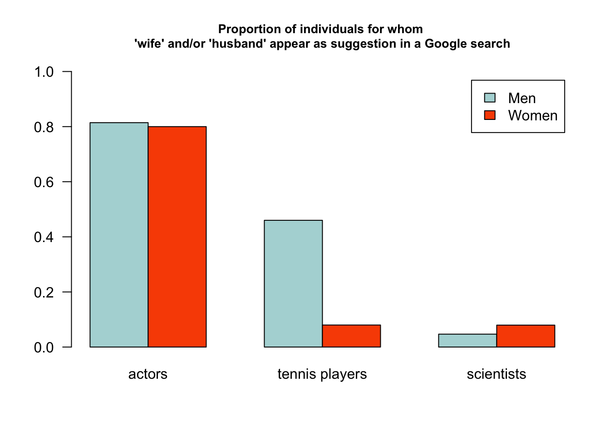
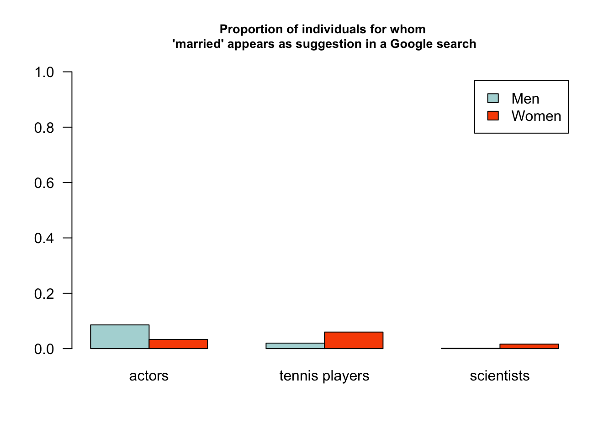
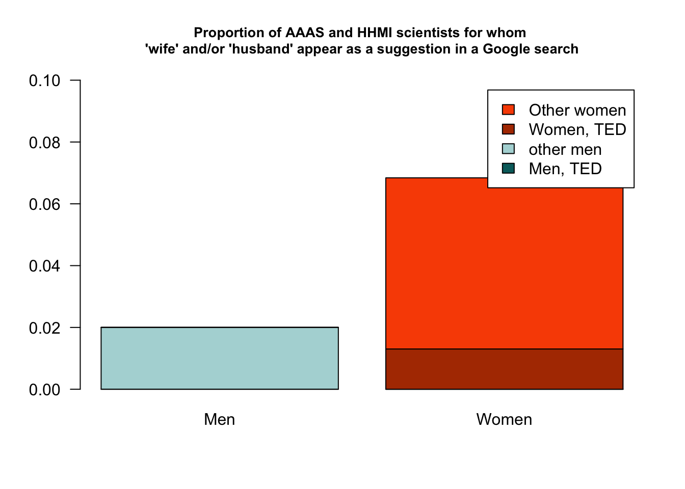
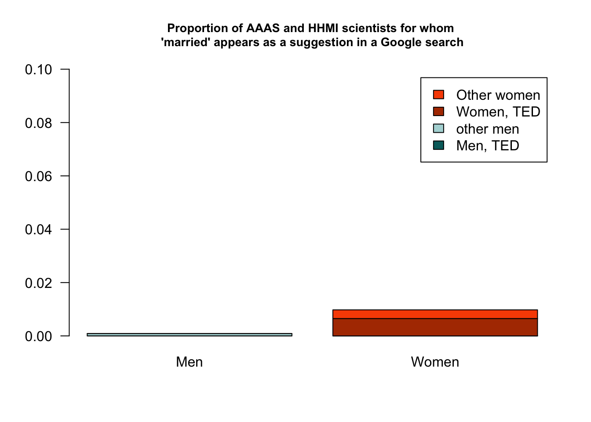

Google's autocomplete feature sometimes yields disturbing results. When looking for female scientists, you may have noticed the appearance of "husband" in the list of suggestions, as reported recently [on Twitter](https://twitter.com/pollyp1/status/733636162263351296). But does this only happen to female scientists?

To answer this question, I gathered names of high profile people with different professions (scientists, tennis players, Hollywood actors), wrote a script to fetch the list of Google suggestions, and compared the proportion of people for whom "husband" and/or "wife", and "married" are suggested. 

**tl;dr:** It looks like the proportions of "wife" and/or "husband" are higher for the female scientists of our dataset (HHMI scientists as well as AAAS members in Class II: Biological Sciences) than for male scientists, but that they are also higher for scientists of our dataset who have given TED talks compared to those who have not. 


# Methods
## Name collection
### Tennis players
I downloaded on 2016-06-06 the names of the 50 best-ranked male and female tennis players (according to the [ATP](http://www.atpworldtour.com/en/rankings/singles) and [WTA](http://www.wtatennis.com/singles-rankings) rankings). [(download the list of names)](tennis.csv).

### Actors
I downloaded on 2016-06-06 a [list of the 100 most valuable movie stars](http://www.vulture.com/2012/07/most-valuable-movie-stars.html), assigned sexes based on first names and pictures. The list contains 30 women names and 70 men names. [(download the list of names)](actors.csv).

### Scientists
I downloaded on 2016-06-06 three datasets: 

- The names of all AAAS members in the [Biological Sciences Class (II)](https://www.amacad.org/multimedia/pdfs/classlist.pdf) (225 women, 898 men, [download the list of names](aaas.csv).);

- The names of all [HHMI scientists](https://www.hhmi.org/scientists/browse?kw=&sort_by=field_scientist_last_name&sort_order=ASC&items_per_page=100) (113 women, 368 men, [download the list of names](hhmi.csv).);

- The names of all TED speakers in the [Science section](https://www.ted.com/talks?sort=popular&topics%5B%5D=science&language=en) (127 women, 293 men, [download the list of names](ted.csv).).

Sexes were assigned on the basis of first names and pictures (apologies if I made mistakes). 

Some names appear in more than one of these lists. I combined all names in a single table, removed duplicates, and indicated with "yes" and "no" the affiliations of each scientist, e.g.

```
##                 name sex     cat wife husband wh married AAAS HHMI TED
## 183 Edward O. Wilson   M science    0       0  0       0  yes   no yes
```
for a total of 1856 individual scientists (427 women and 1429 men). The `wh` column above combines the `wife` and `husband` information (`1` means that the words "wife" and/or "husband" appear in the suggestions). 

## Google Suggestions
I wrote a [bash script](script.sh) to do this step automatically. Google suggestions for each name in each list were downloaded via the <http://suggestqueries.google.com> webpage. For each set of suggestions, the words "wife", "husband", and also "married" were searched for.

Please note that although I made sure to specify `hl=en` in the query (i.e., setting the language to English), Google Suggestions may differ depending on geographic location. You can do this step again simply by typing 

```sh
./script.sh fileprefix
```
in a terminal, where `fileprefix` is either `tennis`, `actors`, `aaas`, `hhmi`, or `ted`.

## Analysis
You just need to look at the [source code](report.Rmd) of this file! It is written in Rmarkdown, so the analysis code is contained in it. 

## Reproducibility
As mentioned above, the results will depend on where you run the analysis from, since Google suggestions depend on location. 
To redo everything on the already collected lists of names, simply type

```sh
./make.sh
```
in a terminal (in the working directory of the project.)

# Results

## Comparing professions




### Actors
There is basically no difference between male (0.81) and female (0.8) actors in terms of frequency of "wife" or "husband" suggestions by Google:

```r
summary(glm(formula = wh ~ sex, data=t.actors, family = binomial))
```

```
## 
## Call:
## glm(formula = wh ~ sex, family = binomial, data = t.actors)
## 
## Deviance Residuals: 
##     Min       1Q   Median       3Q      Max  
## -1.8350   0.6410   0.6410   0.6410   0.6681  
## 
## Coefficients:
##             Estimate Std. Error z value Pr(>|z|)   
## (Intercept)  1.38629    0.45644   3.037  0.00239 **
## sexM         0.09181    0.55027   0.167  0.86750   
## ---
## Signif. codes:  0 '***' 0.001 '**' 0.01 '*' 0.05 '.' 0.1 ' ' 1
## 
## (Dispersion parameter for binomial family taken to be 1)
## 
##     Null deviance: 97.245  on 99  degrees of freedom
## Residual deviance: 97.217  on 98  degrees of freedom
## AIC: 101.22
## 
## Number of Fisher Scoring iterations: 4
```

The difference between male (6/70) and female (1/30) actors in terms of the frequency of the "married" suggestion by Google is not significant either. 

```r
summary(glm(formula = wh ~ married, data=t.actors, family = binomial))
```

```
## 
## Call:
## glm(formula = wh ~ married, family = binomial, data = t.actors)
## 
## Deviance Residuals: 
##      Min        1Q    Median        3Q       Max  
## -1.78222   0.00022   0.67607   0.67607   0.67607  
## 
## Coefficients:
##              Estimate Std. Error z value Pr(>|z|)    
## (Intercept)    1.3596     0.2572   5.287 1.25e-07 ***
## married       16.2064  1495.2956   0.011    0.991    
## ---
## Signif. codes:  0 '***' 0.001 '**' 0.01 '*' 0.05 '.' 0.1 ' ' 1
## 
## (Dispersion parameter for binomial family taken to be 1)
## 
##     Null deviance: 97.245  on 99  degrees of freedom
## Residual deviance: 94.173  on 98  degrees of freedom
## AIC: 98.173
## 
## Number of Fisher Scoring iterations: 16
```

### Tennis players
There is a strong difference between male and female tennis players, but maybe not the one you'd expect: "husband" or "wife" appear in Google's suggestions for 4 women out of the 50 in the dataset, while they appear for 23 men (out of 50). One reason may be that, for an equivalent ranking, the popularity of female tennis players is lower than the popularity of male tennis players. 

```r
summary(glm(formula = wh ~ sex, data=t.tennis, family = binomial))
```

```
## 
## Call:
## glm(formula = wh ~ sex, family = binomial, data = t.tennis)
## 
## Deviance Residuals: 
##     Min       1Q   Median       3Q      Max  
## -1.1101  -1.1101  -0.4084   1.2462   2.2475  
## 
## Coefficients:
##             Estimate Std. Error z value Pr(>|z|)    
## (Intercept)  -2.4423     0.5213  -4.685  2.8e-06 ***
## sexM          2.2820     0.5935   3.845 0.000121 ***
## ---
## Signif. codes:  0 '***' 0.001 '**' 0.01 '*' 0.05 '.' 0.1 ' ' 1
## 
## (Dispersion parameter for binomial family taken to be 1)
## 
##     Null deviance: 116.652  on 99  degrees of freedom
## Residual deviance:  96.871  on 98  degrees of freedom
## AIC: 100.87
## 
## Number of Fisher Scoring iterations: 5
```

What about the "married" word in suggestions? It occured for 1 male players and 3 female players; the difference is not significant either.

```r
summary(glm(formula = married ~ sex, data=t.tennis, family = binomial))
```

```
## 
## Call:
## glm(formula = married ~ sex, family = binomial, data = t.tennis)
## 
## Deviance Residuals: 
##     Min       1Q   Median       3Q      Max  
## -0.3518  -0.3518  -0.2010  -0.2010   2.7971  
## 
## Coefficients:
##             Estimate Std. Error z value Pr(>|z|)    
## (Intercept)  -2.7515     0.5955  -4.621 3.83e-06 ***
## sexM         -1.1403     1.1726  -0.972    0.331    
## ---
## Signif. codes:  0 '***' 0.001 '**' 0.01 '*' 0.05 '.' 0.1 ' ' 1
## 
## (Dispersion parameter for binomial family taken to be 1)
## 
##     Null deviance: 33.589  on 99  degrees of freedom
## Residual deviance: 32.501  on 98  degrees of freedom
## AIC: 36.501
## 
## Number of Fisher Scoring iterations: 6
```

### Scientists
If we now turn to the scientists dataset, we first observe that the frequency at which the "wife" and "husband" suggestions appear is much lower (0.05 for men and women combined) than for the actors dataset for instance. What about the difference between men and women in this dataset?

```r
summary(glm(formula = wh ~ sex, data=t.science, family = binomial))
```

```
## 
## Call:
## glm(formula = wh ~ sex, family = binomial, data = t.science)
## 
## Deviance Residuals: 
##     Min       1Q   Median       3Q      Max  
## -0.4074  -0.3099  -0.3099  -0.3099   2.4739  
## 
## Coefficients:
##             Estimate Std. Error z value Pr(>|z|)    
## (Intercept)  -2.4474     0.1788 -13.691  < 2e-16 ***
## sexM         -0.5646     0.2182  -2.587  0.00967 ** 
## ---
## Signif. codes:  0 '***' 0.001 '**' 0.01 '*' 0.05 '.' 0.1 ' ' 1
## 
## (Dispersion parameter for binomial family taken to be 1)
## 
##     Null deviance: 784.44  on 1855  degrees of freedom
## Residual deviance: 778.14  on 1854  degrees of freedom
## AIC: 782.14
## 
## Number of Fisher Scoring iterations: 5
```

And if we consider the "married" suggestion:

```r
summary(glm(formula = married ~ sex, data=t.science, family = binomial))
```

```
## 
## Call:
## glm(formula = married ~ sex, family = binomial, data = t.science)
## 
## Deviance Residuals: 
##     Min       1Q   Median       3Q      Max  
## -0.1818  -0.0529  -0.0529  -0.0529   3.6254  
## 
## Coefficients:
##             Estimate Std. Error z value Pr(>|z|)    
## (Intercept)  -4.0943     0.3811 -10.743  < 2e-16 ***
## sexM         -2.4758     0.8037  -3.081  0.00207 ** 
## ---
## Signif. codes:  0 '***' 0.001 '**' 0.01 '*' 0.05 '.' 0.1 ' ' 1
## 
## (Dispersion parameter for binomial family taken to be 1)
## 
##     Null deviance: 113.88  on 1855  degrees of freedom
## Residual deviance: 101.72  on 1854  degrees of freedom
## AIC: 105.72
## 
## Number of Fisher Scoring iterations: 9
```

In both cases, there is a significant effect of sex, the proportions of "wife" and/or "husband", and of "maried" being higher among Google suggestions for female scientists. 

## Further dissecting the "science" dataset

Some TED speakers are not scientists, but science journalists. So here, we will focus on the AAAS+HHMI datasets, keeping the information of whether the scientists have given TED talks. TED talks are considered here as a proxy of fame / public exposure (some TED talks have millions of views!). It is likely that the more well-known a scientist is, the more likely he/she is to be Googled... and maybe the more likely it is to see "wife" and/or "husband", and "married" appear in the suggestions.  

Here are the sizes of each categories of the AAAS+HHMI data:

```
##      sex
## TED     F    M
##   no  300 1136
##   yes   7   13
```

### "wife" and/or "husband" for HHMI + AAAS scientists


```r
model.hhmiaaas.wh.s <- glm(formula = wh ~ sex, data=sciencesubset, family = binomial)
model.hhmiaaas.wh.t <- glm(formula = wh ~ TED, data=sciencesubset, family = binomial)
model.hhmiaaas.wh.st <- glm(formula = wh ~ sex + TED, data=sciencesubset, family = binomial)
model.hhmiaaas.wh.i <- glm(formula = wh ~ sex * TED, data=sciencesubset, family = binomial)

model.sel(model.hhmiaaas.wh.s, model.hhmiaaas.wh.t, model.hhmiaaas.wh.st, model.hhmiaaas.wh.i)
```

```
## Model selection table 
##                       (Int) sex TED sex:TED df   logLik  AICc delta weight
## model.hhmiaaas.wh.i  -2.812   +   +       +  4 -182.549 373.1  0.00  0.842
## model.hhmiaaas.wh.st -2.714   +   +          3 -185.278 376.6  3.45  0.150
## model.hhmiaaas.wh.s  -2.611   +              2 -189.318 382.6  9.52  0.007
## model.hhmiaaas.wh.t  -3.552       +          2 -192.675 389.4 16.23  0.000
## Models ranked by AICc(x)
```

The best model seems to be the one that takes into account sex, TED talks, and the interaction between sex and TED talks:

```r
summary(model.hhmiaaas.wh.i)
```

```
## 
## Call:
## glm(formula = wh ~ sex * TED, family = binomial, data = sciencesubset)
## 
## Deviance Residuals: 
##     Min       1Q   Median       3Q      Max  
## -1.3018  -0.2023  -0.2023  -0.2023   2.7928  
## 
## Coefficients:
##             Estimate Std. Error z value Pr(>|z|)    
## (Intercept)  -2.8122     0.2497 -11.262  < 2e-16 ***
## sexM         -1.0671     0.3267  -3.266 0.001090 ** 
## TEDyes        3.0999     0.8035   3.858 0.000114 ***
## sexM:TEDyes -15.7867   665.5145  -0.024 0.981075    
## ---
## Signif. codes:  0 '***' 0.001 '**' 0.01 '*' 0.05 '.' 0.1 ' ' 1
## 
## (Dispersion parameter for binomial family taken to be 1)
## 
##     Null deviance: 394.59  on 1455  degrees of freedom
## Residual deviance: 365.10  on 1452  degrees of freedom
## AIC: 373.1
## 
## Number of Fisher Scoring iterations: 15
```

Here are the numbers of AAAS and HHMI scientists for whom "wife" and/or "husband" appear as suggestions:

```
##      sex
## TED    F  M
##   no  17 23
##   yes  4  0
```

In terms of proportions for each sex, this corresponds to


### "married" for HHMI + AAAS scientists


```r
model.hhmiaaas.m.s <- glm(formula = married ~ sex, data=sciencesubset, family = binomial)
model.hhmiaaas.m.t <- glm(formula = married ~ TED, data=sciencesubset, family = binomial)
model.hhmiaaas.m.st <- glm(formula = married ~ sex + TED, data=sciencesubset, family = binomial)
model.hhmiaaas.m.i <- glm(formula = married ~ sex * TED, data=sciencesubset, family = binomial)

model.sel(model.hhmiaaas.m.s, model.hhmiaaas.m.t, model.hhmiaaas.m.st, model.hhmiaaas.m.i)
```

```
## Model selection table 
##                      (Int) sex TED sex:TED df  logLik AICc delta weight
## model.hhmiaaas.m.st -5.356   +   +          3 -19.588 45.2  0.00  0.483
## model.hhmiaaas.m.i  -5.700   +   +       +  4 -18.925 45.9  0.69  0.343
## model.hhmiaaas.m.t  -6.575       +          2 -21.653 47.3  2.12  0.167
## model.hhmiaaas.m.s  -4.618   +              2 -24.916 53.8  8.65  0.006
## Models ranked by AICc(x)
```

The models with and without sex*TED interaction are not distinguishable, so we will choose the simpler:

```r
summary(model.hhmiaaas.m.st)
```

```
## 
## Call:
## glm(formula = married ~ sex + TED, family = binomial, data = sciencesubset)
## 
## Deviance Residuals: 
##     Min       1Q   Median       3Q      Max  
## -0.7182  -0.0323  -0.0323  -0.0323   3.8887  
## 
## Coefficients:
##             Estimate Std. Error z value Pr(>|z|)    
## (Intercept)  -5.3563     0.7903  -6.777 1.22e-11 ***
## sexM         -2.2040     1.1825  -1.864   0.0623 .  
## TEDyes        4.1328     1.0587   3.904 9.48e-05 ***
## ---
## Signif. codes:  0 '***' 0.001 '**' 0.01 '*' 0.05 '.' 0.1 ' ' 1
## 
## (Dispersion parameter for binomial family taken to be 1)
## 
##     Null deviance: 55.166  on 1455  degrees of freedom
## Residual deviance: 39.176  on 1453  degrees of freedom
## AIC: 45.176
## 
## Number of Fisher Scoring iterations: 10
```

Here are the numbers of AAAS and HHMI scientists for whom "married" appears as suggestion:

```
##      sex
## TED   F M
##   no  1 1
##   yes 2 0
```

In terms of proportions for each sex, this corresponds to



  
    
    
    
    


    
    
    
